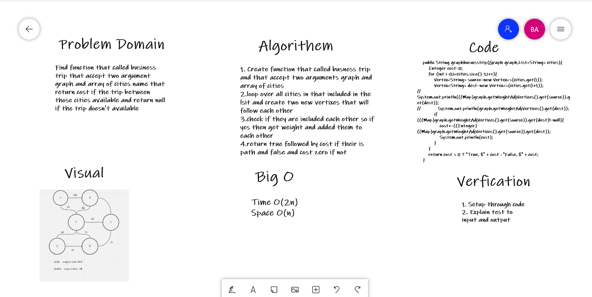

# Challenge Summary
<!-- Description of the challenge -->

Write a function called business trip:

    Arguments: graph, array of city names
    Return: cost or null
    Determine whether the trip is possible with direct flights, and how much it would cost.


## Whiteboard Process
<!-- Embedded whiteboard image -->


## Approach & Efficiency
<!-- What approach did you take? Why? What is the Big O space/time for this approach? -->
Big (O)

Time Complexity : O(2n) space  : O(n)

## Solution
<!-- Show how to run your code, and examples of it in action -->

```
    public String graphbusnisstrip(Graph graph,List<String> cities){
        Integer cost=0;
        for (int i=0;i<cities.size()-1;i++){
            Vertex<String> source=new Vertex<>(cities.get(i));
            Vertex<String> dest=new Vertex<>(cities.get(i+1));
//            System.out.println(((Map)graph.getWieghtAdjVertices().get(source)).get(dest));
//            System.out.println(graph.getWieghtAdjVertices().get(dest));
            if (((Map)graph.getWieghtAdjVertices().get(source)).get(dest)!=null){
                cost+=((Integer)((Map)graph.getWieghtAdjVertices().get(source)).get(dest));
                System.out.println(cost);
            }
        }
        return cost > 0 ? "True, $" + cost : "False, $" + cost;
    }
```