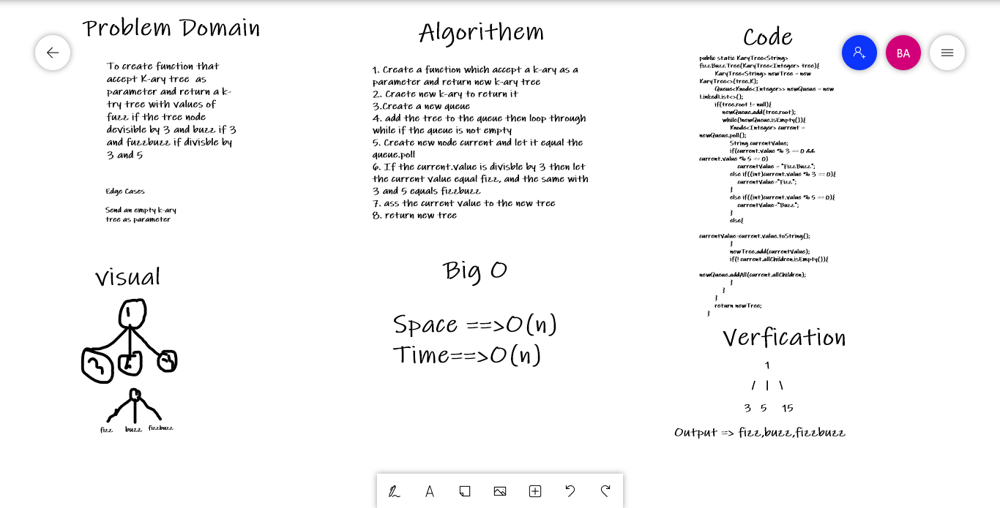

# Challenge Summary
<!-- Description of the challenge -->
To create function that accept K-ary tree  as parameter and return a k-try tree with values of fuzz if the tree node devisible by 3 and buzz if 3 and fuzzbuzz if divisble by 3 and 5 

## Whiteboard Process
<!-- Embedded whiteboard image -->

## Approach & Efficiency
<!-- What approach did you take? Why? What is the Big O space/time for this 
approach? -->

Space O(n)
Time O(n)

## Solution
<!-- Show how to run your code, and examples of it in action -->
input
    1
/   |   \
3   5   15

output=> fizz,buzz,fizzbuzz