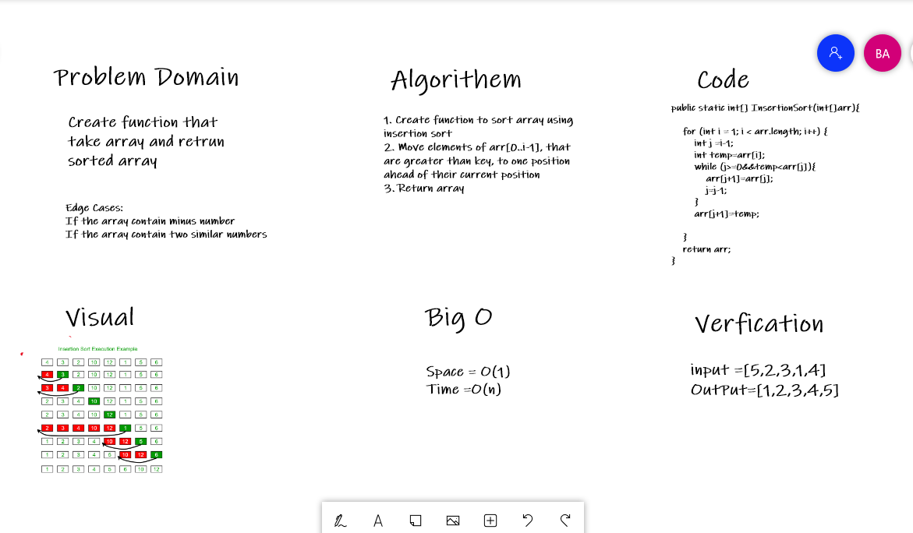
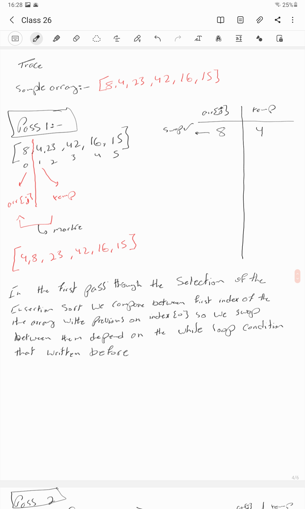
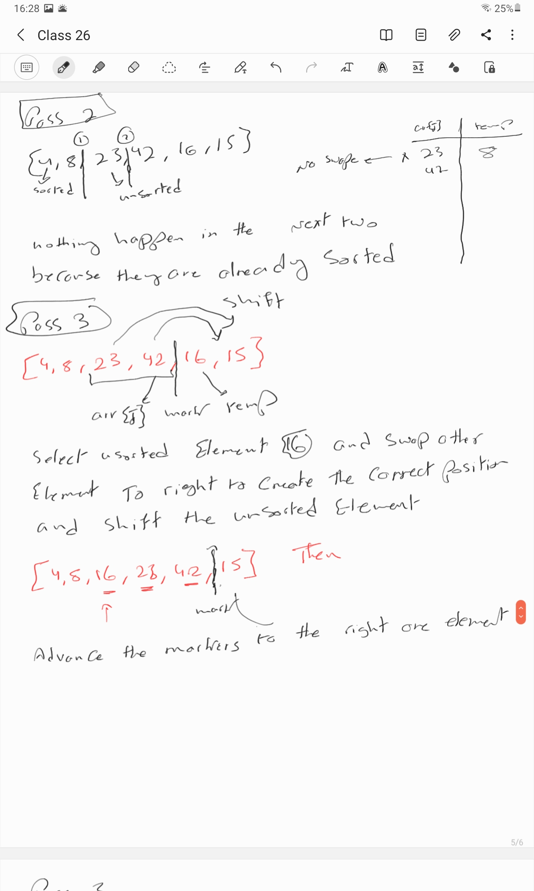
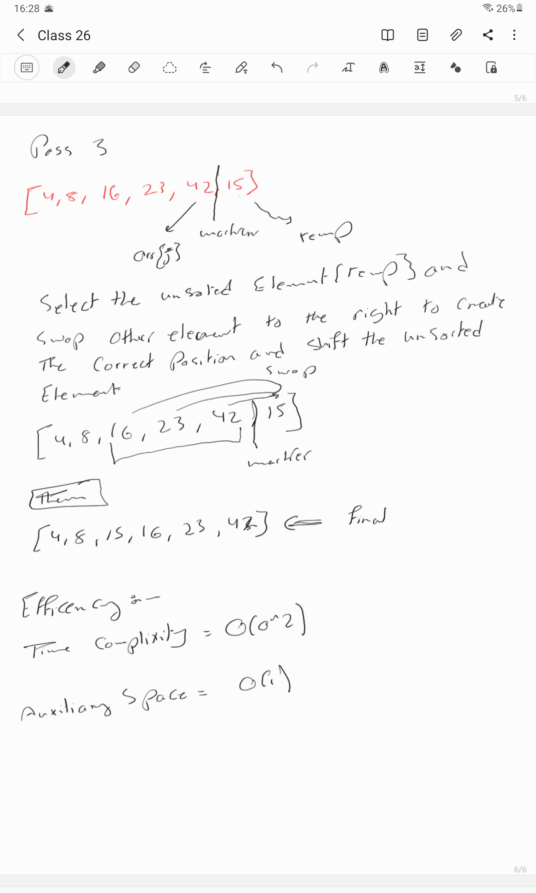

# BLOG

# Challenge Summary
<!-- Description of the challenge -->
Write a function that accepts an array of unsorted integers, and returns a sorted array by a recursive merge sort algorithm.

## Whiteboard Process
<!-- Embedded whiteboard image -->

## Approach & Efficiency
<!-- What approach did you take? Why? What is the Big O space/time for this approach? -->

Space O(1)
Time O(n)
## Solution
<!-- Show how to run your code, and examples of it in action -->

Input => {9,6,5,4,7,8}

Output <= {4,5,6,7,8,9}

