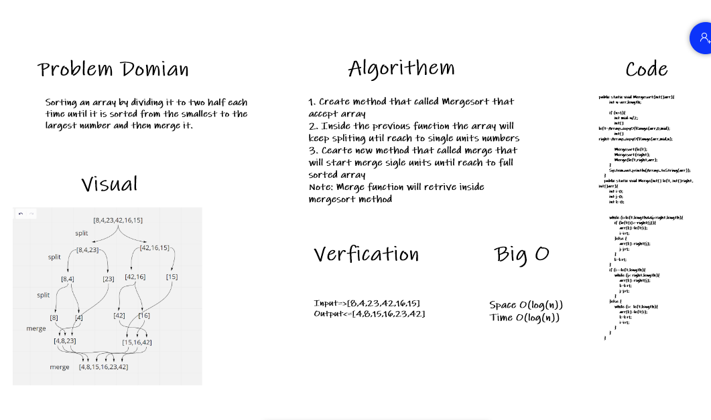

# Challenge Summary
<!-- Description of the challenge -->
Sorting an array by dividing it to two half each time until it is sorted from the smallest to the largest number and then merge it.

## Whiteboard Process
<!-- Embedded whiteboard image -->

## Approach & Efficiency
<!-- What approach did you take? Why? What is the Big O space/time for this approach? -->
Space O(log(n))  
Time O(log(n))

## Solution
<!-- Show how to run your code, and examples of it in action -->

Input => [8,4,23,42,16,15]  
Output => [4,8,15,16,23,42]

