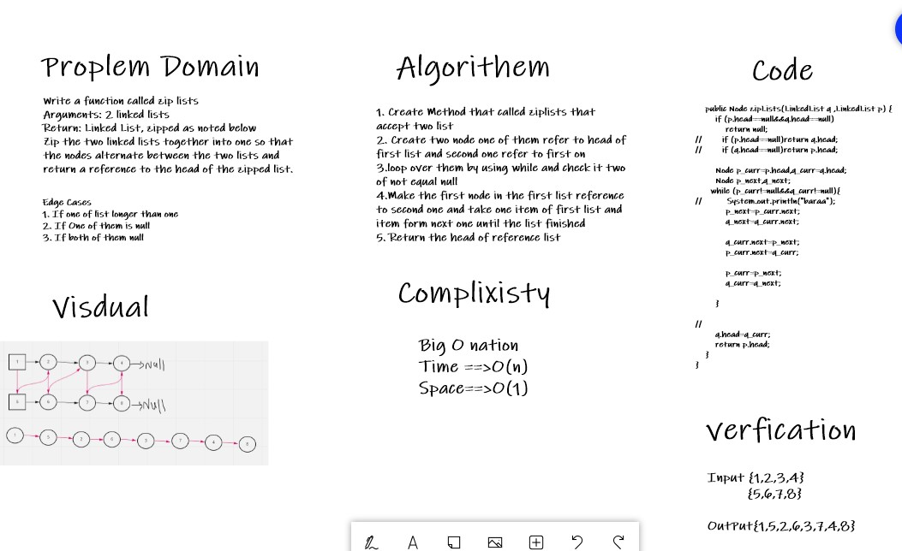
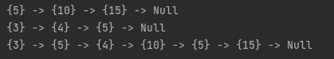

# Challenge Summary
<!-- Description of the challenge -->
The code challing today ask me to create method that deals with linklists and it is called zipplists, so this method have to accept to lists and reutrn it merged of zipped

## Whiteboard Process
<!-- Embedded whiteboard image -->


## Approach & Efficiency
<!-- What approach did you take? Why? What is the Big O space/time for this approach? -->
Time Big O is O(n) because i iterate using while loop and Space Big O is O(1) because i didn't use any type of arrays

## Solution
<!-- Show how to run your code, and examples of it in action -->
Input
```
        LinkedList list1=new LinkedList();
        list1.insert(5);
        list1.insert(10);
        list1.insert(15);
        LinkedList list2=new LinkedList();
        list2.insert(3);
        list2.insert(4);
        list2.insert(5);
        LinkedList new1=new LinkedList();
        list1.show();
        list2.show();
        new1.head= new1.zipLists(list1,list2);
```

OutPut

