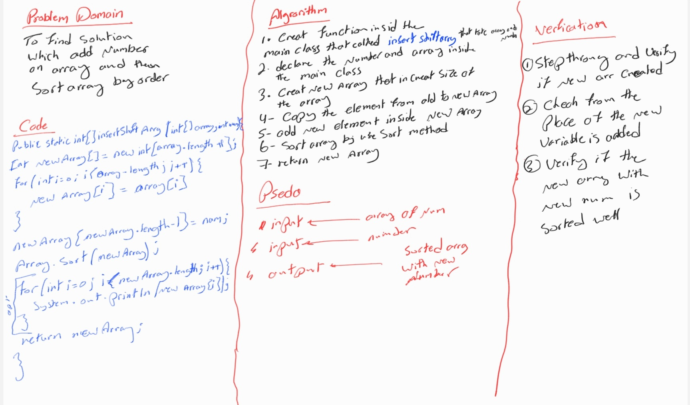

# array-insert-shift

## WhiteBoard



Code for virification

```
import java.util.Arrays;

public class MyMain {
    public static void main(String[] args) {
        int num=5;
        int[]array={2,4,6,-8};
        int[] finalArray= insertShiftArray(array,num);
        for (int i=0;i<finalArray.length;i++){
            System.out.println("New Array is"+finalArray[i]+",");
        }
    }
    public static int[] insertShiftArray(int[]array,int num){

int newArray[]=new int[array.length+1];
for(int i=0;i<array.length;i++){
    newArray[i]=array[i];
}
newArray[newArray.length-1]=num;
        Arrays.sort(newArray);
        for (int i=0;i<newArray.length;i++){
            System.out.println(newArray[i]);
        }
        return newArray;
    }
}
```