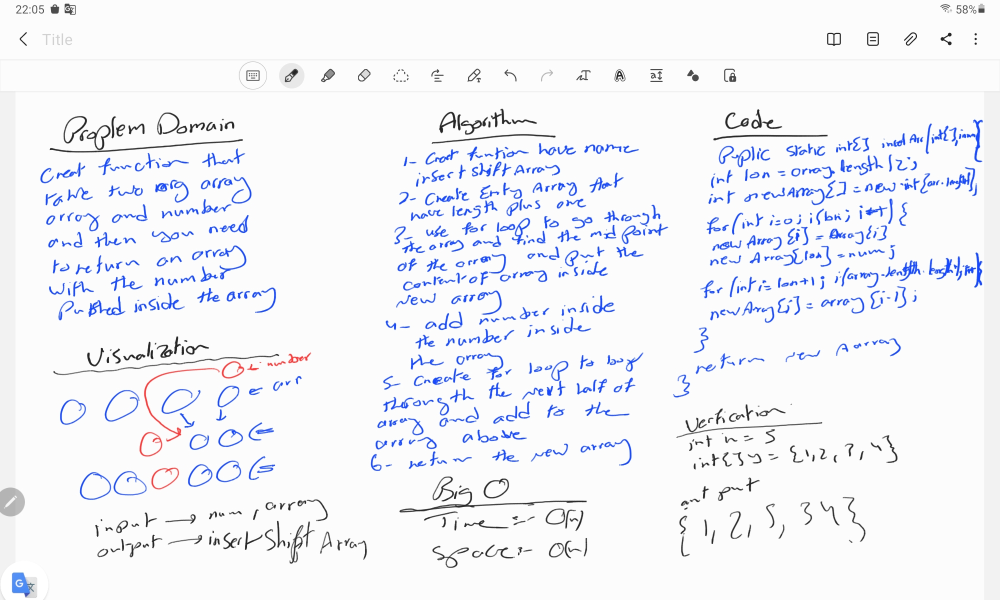

# Array Reserved 

## resubmit 

## code challenge day 1 (28/7/2021)



```
import java.util.Arrays;

public class MyMain {
    public static void main(String[] args) {
        int num=5;
        int[]array={1,2,3,4,6,8,6,1,5,10};
        int[] finalArray= insertShiftArray(array,num);
        for (int i=0;i<finalArray.length;i++){
            System.out.println("New Array is"+finalArray[i]+",");
        }
    }
    public static int[] insertShiftArray(int[]array,int num){
        int lon=array.length/2;
int newArray[]=new int[array.length+1];

for(int i=0;i<lon;i++) {
    newArray[i] = array[i];
    newArray[lon]=num;
}
for (int i=lon+1;i<array.length+1;i++){
    newArray[i]=array[i-1];
    System.out.println(newArray[i]);
}

        return newArray;
    }
}
```