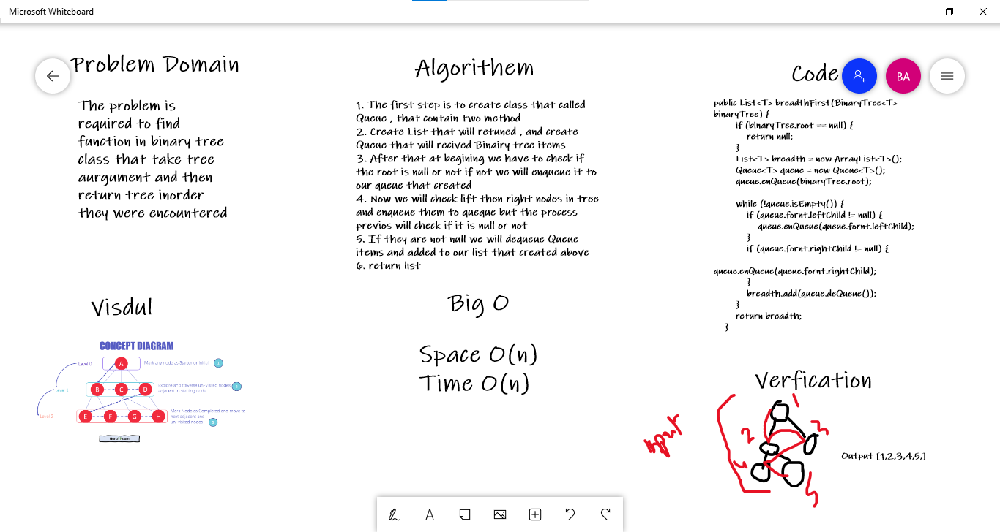

# Challenge Summary
<!-- Description of the challenge -->
The problem is required to find function in binary tree class that take tree aurgument and then return tree inorder they were encountered 

## Whiteboard Process
<!-- Embedded whiteboard image -->


## Approach & Efficiency
<!-- What approach did you take? Why? What is the Big O space/time for this approach? -->
Space O(n)
Time O(n)

## Solution
<!-- Show how to run your code, and examples of it in action -->
Input =>
```
         1
        / \
       2   3
      / \
     4   5
```

Output<= [1,2,3,4,5]

