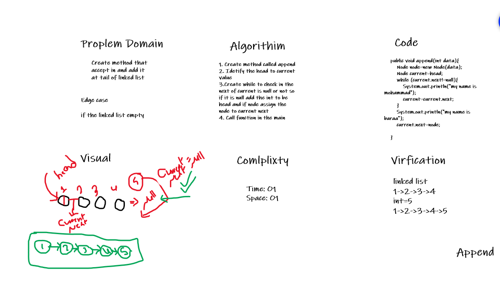
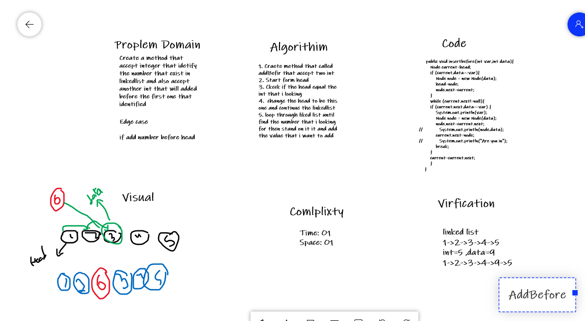
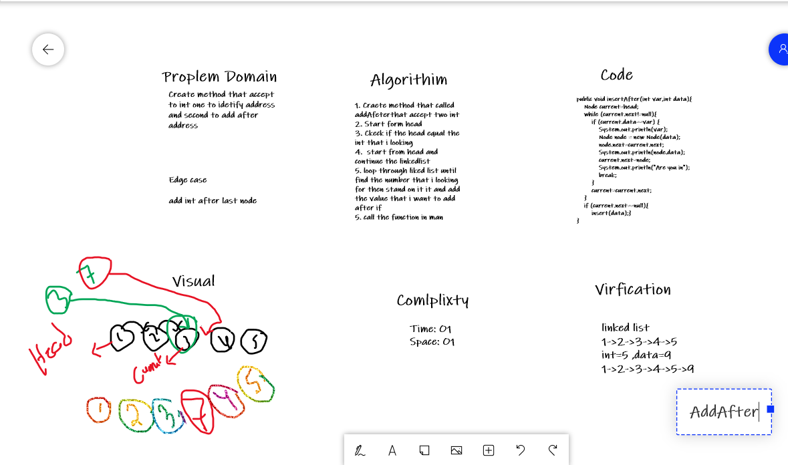

# Challenge Summary
<!-- Description of the challenge -->
1. The fisrt challenge ask me to add int at the tail of the linked list 
2. Second one ask me to add int before identified int
2. Third one ask me to add int after identified int

## Whiteboard Process
<!-- Embedded whiteboard image -->

## Approach & Efficiency
<!-- What approach did you take? Why? What is the Big O space/time for this approach? -->
included in each whiteboard

## Solution
<!-- Show how to run your code, and examples of it in action -->
included in whiteboard