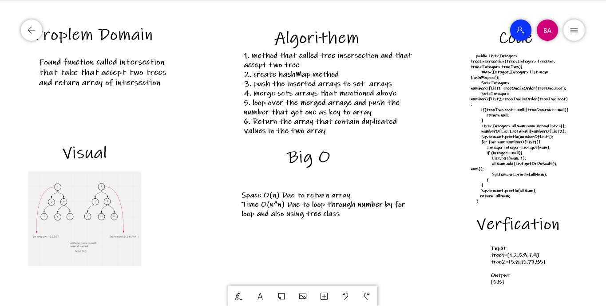

# Challenge Summary
<!-- Description of the challenge -->
Found function called intersection that take that accept two trees and return array of intersection
## Whiteboard Process
<!-- Embedded whiteboard image -->

## Approach & Efficiency
<!-- What approach did you take? Why? What is the Big O space/time for this approach? -->
Space O(n) due to use array to return our results
Time O(n^n) Due to loop through number by for loop and also using tree class

## Solution
<!-- Show how to run your code, and examples of it in action -->
Input
tree1=[1,2,5,8,7,9]
tree2=[5,8,15,77,85]

Output
[5,8]