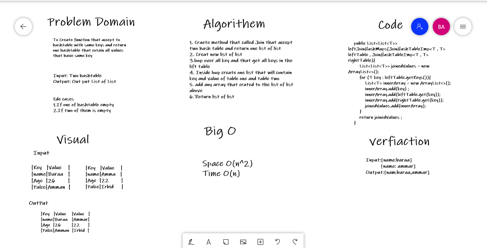

# Hashmap LEFT JOIN
<!-- Short summary or background information -->
To Create function that accept to hashtable with same keys and return one hashtable that cotain all values that have same key


## Challenge
<!-- Description of the challenge -->


## Approach & Efficiency
<!-- What approach did you take? Why? What is the Big O space/time for this 
approach? -->

Space O(n^2)
Time O(n)


## Solution
<!-- Embedded whiteboard image -->

Input

```
Key|Value    
---|---
name|Baraa   
Age  |26        
Palce|Amman  

|Key   |Value    |
|---|---|
|name|Amma   |
|Age  |22        |
|Palce|Irbid     |
```

OutPut

```
|Key   |Value    |Value   |
|---|---|---|
|name|Baraa   |Ammar|
|Age  |26        |22      |
|Palce|Amman  |Irbid  |
```