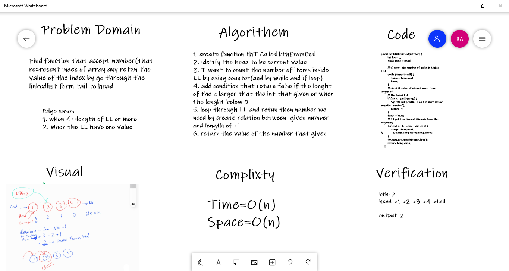

# Challenge Summary
<!-- Description of the challenge -->
This code challenge requiste to return the value of given index but not index from begining the index from tail that exactly a big challenge
or in specific description find the kth node form end of a singly linked list

## Whiteboard Process
<!-- Embedded whiteboard image -->

## Approach & Efficiency
<!-- What approach did you take? Why? What is the Big O space/time for this approach? -->
1. find length of the LL ==> one traversal ==> O(n)
2. check if to avoid apply fund on LL that have length more that kth [check]
3. Tarversal LL til xth node ==>traversal==>O(n) Time

## Solution
<!-- Show how to run your code, and examples of it in action -->
1. if we have linkedlist like below
2. head => 1 => 2 => 3 => 4 =>tail
3. the code will idetify the first point head 
4. create counter to find out the length of LL
5. find a relation between head and tail 
6. loop through LL to find the value of index that i want
5. the function will return 2 if kth =1 
