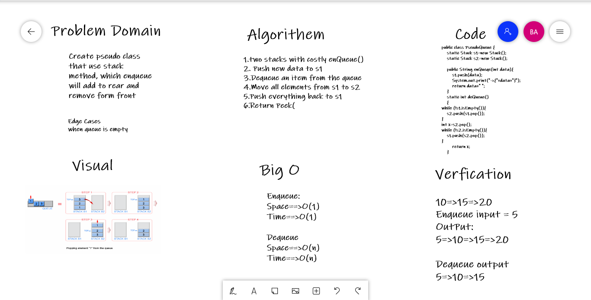

# Challenge Summary
<!-- Description of the challenge -->
Create pseudo class that use stack method, which enqueue will add to rear and remove form front 

## Whiteboard Process
<!-- Embedded whiteboard image -->


## Approach & Efficiency
<!-- What approach did you take? Why? What is the Big O space/time for this approach? -->
Regarding to enqueque 

Space : O(1)
Time : O(1)

Regarding to dequeque 

Space : O(n)
Time : O(n)

## Solution
<!-- Show how to run your code, and examples of it in action -->

```
public class PseudoQueue {
    static Stack s1=new Stack();
    static Stack s2=new Stack();

    public String enQueqe(int data){
        s1.push(data);
        System.out.print("->{"+data+"}");
        return data+" ";
    }
    static int deQueue()
    {
while (!s1.isEmpty()){
    s2.push(s1.pop());
}
int x=s2.pop();
while (!s2.isEmpty()){
    s1.push(s2.pop());
}
        return x;
    }
```

