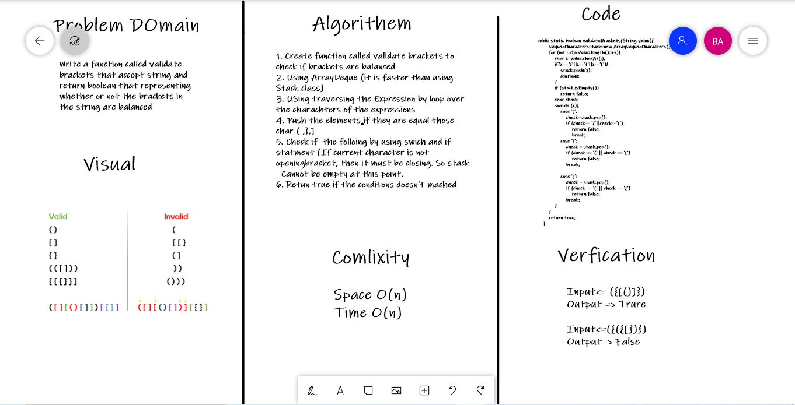

# Challenge Summary
<!-- Description of the challenge -->
Write a function called validate brackets that accept string and return boolean that representing whether or not the brackets in the string are balanced

## Whiteboard Process
<!-- Embedded whiteboard image -->


## Approach & Efficiency
<!-- What approach did you take? Why? What is the Big O space/time for this approach? -->
Space O(n)
Time O(n)

## Solution
<!-- Show how to run your code, and examples of it in action -->

```
    public static boolean validateBrackets(String value){
        Deque<Character>stack=new ArrayDeque<Character>();
        for (int i=0;i<value.length();i++){
            char x=value.charAt(i);
            if(x =='{'||x=='('||x=='['){
                stack.push(x);
                continue;
            }
            if (stack.isEmpty())
                return false;
            char check;
            switch (x){
                case ')':
                    check=stack.pop();
                    if (check== '{'||check=='[')
                        return false;
                        break;
                case '}':
                    check = stack.pop();
                    if (check == '(' || check == '[')
                        return false;
                    break;

                case ']':
                    check = stack.pop();
                    if (check == '(' || check == '{')
                        return false;
                    break;
            }
        }
        return true;
    }
```

```
Input<= ({[()]})
Output => Trure

Input<=({({[})})
Output=> False
```